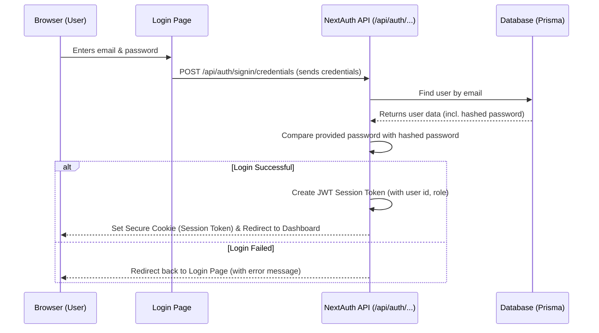

# Chapter 1: Authentication & Authorization (NextAuth)

Welcome to the Web-Planner-AI project! This is the first chapter in our journey to understand how this application works. Today, we'll explore how the application handles security – specifically, making sure users are who they say they are and controlling what they can access.

## What's the Problem? Keeping Things Secure!

Imagine you're building a fantastic web plan using Web-Planner-AI. You wouldn't want just anyone to be able to see or change your brilliant ideas, right? That's where security comes in. We need a system to:

1.  **Verify Users:** Make sure someone logging in is actually the person they claim to be.
2.  **Control Access:** Once logged in, ensure users can only see and do things they're supposed to (like accessing *their own* projects, not someone else's, unless shared).

Think of it like a friendly but firm security guard for our web application. This guard checks IDs at the door and makes sure people only go into the rooms they have permission for.

In Web-Planner-AI, we use a popular tool called **NextAuth.js** to act as our digital security guard.

## Key Security Concepts

Let's break down the main ideas:

1.  **Authentication (Who are you?):**
    *   This is like showing your ID card. It's the process of proving you are who you say you are.
    *   In our app, this usually happens when you enter your email and password on the login page. NextAuth checks if these match what's stored securely in our database.

2.  **Authorization (What can you do?):**
    *   Once you're authenticated (the guard verified your ID), authorization determines what actions you're allowed to perform.
    *   Are you a regular `USER` who can create and view your own plans? Or are you an `ADMIN` who might have extra powers, like managing all users or system settings?
    *   It also ensures you can only access *your* specific projects and plans, not someone else's (unless they explicitly share it with you).

3.  **Sessions (Your Temporary Access Pass):**
    *   Logging in every single time you click a button would be annoying! So, after you successfully log in (authenticate), NextAuth gives your browser a temporary "access pass." This is often stored in something called a **JWT (JSON Web Token)**, which is like a digitally signed, tamper-proof token.
    *   Your browser sends this pass along with each request to the server. The server quickly checks the pass to confirm you're still logged in, without needing your password again for a while.

4.  **Middleware (The Checkpoints):**
    *   Imagine guards standing at the entrance of different sections of a building (like the main dashboard or the admin area).
    *   In Next.js (the framework our app is built on), **Middleware** acts like these checkpoints. It's a piece of code that runs *before* a page or API endpoint is accessed.
    *   Our middleware uses NextAuth to check if the incoming request has a valid session "access pass." If not, it might redirect the user to the login page. It can also check if the user has the right *role* (like ADMIN) to access certain restricted areas.

## How We Use NextAuth in Web-Planner-AI

Let's follow a user, Alice, as she interacts with the app:

1.  **Login Attempt:** Alice goes to the login page (`/login`) and enters her email and password.
2.  **Verification:** She clicks "Login". The browser sends her credentials to a special NextAuth API route (`/api/auth/signin/credentials`).
3.  **NextAuth Checks:** NextAuth takes over. It looks up Alice's email in the database ([Database Management (Prisma)](07_database_management__prisma_.md)). If found, it compares the password she entered with the securely stored password hash.
4.  **Session Creation:** If the passwords match, NextAuth confirms Alice is authenticated! It creates a session for her, generating a JWT "access pass" containing her user ID and role (`USER` or `ADMIN`). This pass is sent back to Alice's browser, usually stored in a secure cookie.
5.  **Accessing Dashboard:** Alice clicks a link to her dashboard (`/dashboard`).
6.  **Middleware Check:** Before the dashboard page loads, our Middleware runs. It uses NextAuth functions to check Alice's browser request for the valid session cookie (the access pass).
7.  **Access Granted:** Since Alice has a valid pass, the middleware allows the request to proceed, and the dashboard page loads, showing Alice *her* projects.
8.  **Accessing Admin Area (Denied):** If Alice tries to go to `/admin`, the middleware checks her session pass again. It sees her role is `USER`, not `ADMIN`. Access is denied, and she might be redirected back to her dashboard or the login page.

### Code Sneak Peek: Setting up Login

Here's a simplified look at how we tell NextAuth to handle email/password logins (`CredentialsProvider`) inside the main NextAuth configuration file:

```typescript
// File: app/api/auth/[...nextauth]/route.ts (simplified)

import NextAuth from "next-auth"
import CredentialsProvider from "next-auth/providers/credentials"
import { PrismaAdapter } from "@next-auth/prisma-adapter"
import { PrismaClient } from "@prisma/client"
import { compare } from "bcryptjs" // For secure password checking

const prisma = new PrismaClient()

export const authOptions = {
  adapter: PrismaAdapter(prisma), // Connects NextAuth to our database
  providers: [
    CredentialsProvider({
      name: "Credentials",
      credentials: { // Defines the login form fields
        email: { label: "Email", type: "email" },
        password: { label: "Password", type: "password" }
      },
      async authorize(credentials) {
        // --- This function runs when a user tries to log in ---
        if (!credentials?.email || !credentials?.password) return null;

        const user = await prisma.user.findUnique({
          where: { email: credentials.email },
        });

        // Check if user exists and password is correct
        if (!user || !(await compare(credentials.password, user.password))) {
          return null; // Login failed
        }

        // Login successful! Return user data for the session.
        return { id: user.id, email: user.email, role: user.role };
      }
    })
  ],
  // ... other configurations like session strategy, pages ...
};

const handler = NextAuth(authOptions);
export { handler as GET, handler as POST };
```

**Explanation:**
*   We import necessary tools like `NextAuth`, `CredentialsProvider`, and our database connector (`PrismaAdapter`).
*   Inside `authOptions`, the `providers` array lists ways users can log in. We use `CredentialsProvider` for email/password.
*   The `authorize` function is the core logic: it receives the email/password, finds the user in the database, securely compares the password, and returns the user's details if successful, or `null` if login fails.

### Code Sneak Peek: Adding Info to the Session

How does NextAuth remember the user's ID and role? Through `callbacks`:

```typescript
// File: app/api/auth/[...nextauth]/route.ts (callbacks part)

// ... inside authOptions ...
  session: {
    strategy: "jwt", // Use JSON Web Tokens for sessions
  },
  callbacks: {
    // Runs when a JWT (access pass) is created or updated
    async jwt({ token, user }) {
      if (user) { // When user first logs in
        token.id = user.id; // Add user ID to the token
        token.role = user.role; // Add user role to the token
      }
      return token;
    },
    // Runs when a session is accessed (e.g., on page load)
    async session({ session, token }) {
      if (session.user) {
        session.user.id = token.id as string; // Make ID available in session object
        session.user.role = token.role as "USER" | "ADMIN"; // Make role available
      }
      return session;
    },
  }
// ...
```

**Explanation:**
*   `strategy: "jwt"` tells NextAuth to use JWTs for sessions (our access passes).
*   The `jwt` callback adds the `id` and `role` from the user object (returned by `authorize`) directly *into* the JWT when it's first created.
*   The `session` callback takes the information stored in the JWT (`token`) and makes it easily accessible in the `session` object used by our application code.

### Code Sneak Peek: Protecting Routes with Middleware

This file acts as our checkpoint guard:

```typescript
// File: middleware.ts (simplified)

import { withAuth } from "next-auth/middleware";
import { NextResponse } from "next/server";

export default withAuth(
  // This function runs IF the user is authorized (checked below)
  function middleware(request) {
    // Can add more logic here if needed, otherwise just proceed
    return NextResponse.next();
  },
  {
    callbacks: {
      // This determines IF the user is authorized for the requested page
      authorized: ({ token, req }) => {
        const isAdminRoute = req.nextUrl.pathname.startsWith('/admin');

        // Rule 1: Must have a valid token (be logged in) for any protected route
        if (!token) return false;

        // Rule 2: If it's an admin route, MUST have ADMIN role
        if (isAdminRoute && token.role !== "ADMIN") return false;

        // Otherwise, access is allowed (logged in, and role is okay for route)
        return true;
      },
    },
    pages: { // Where to redirect if authorization fails
      signIn: "/login", // If not logged in
      error: "/login", // On other errors
    }
  }
);

// Apply middleware to all routes except public ones like API, static files, login page
export const config = {
  matcher: [
    '/((?!api/auth|api/public|_next/static|_next/image|favicon.ico|login).*)',
  ],
};
```

**Explanation:**
*   `withAuth` is a helper from NextAuth that simplifies middleware creation.
*   The magic happens in the `authorized` callback:
    *   It checks if a `token` exists (Is the user logged in?).
    *   It checks if the requested page (`req.nextUrl.pathname`) is an admin page.
    *   If it's an admin page, it *also* checks if the `token.role` is "ADMIN".
    *   It returns `true` (allow access) or `false` (deny access).
*   If `authorized` returns `false`, `withAuth` automatically redirects the user to the page specified in `pages.signIn`.
*   The `config.matcher` tells Next.js which paths this middleware should protect.

## Under the Hood: The Login Flow

Let's visualize the basic login flow:



**Steps:**

1.  **User Interaction:** You type your details into the Login Page in your Browser.
2.  **API Request:** The page sends these details securely to the NextAuth API endpoint.
3.  **Database Check:** The NextAuth code (specifically the `authorize` function we saw earlier) uses Prisma to look up the user in the Database.
4.  **Password Verification:** If the user is found, NextAuth securely compares the password you provided against the stored hash.
5.  **Session Creation (Success):** If passwords match, NextAuth generates the JWT session token containing essential user info (like ID and role) and tells the Browser to store it as a secure cookie. The browser is often redirected to the main application page (e.g., the dashboard).
6.  **Redirection (Failure):** If the user isn't found or the password doesn't match, NextAuth redirects the Browser back to the Login Page, usually indicating an error.

## Conclusion

Authentication (proving identity) and Authorization (controlling access) are crucial for keeping user data safe and ensuring the application works as intended. We use **NextAuth.js** as our powerful "security guard," handling logins, managing user sessions with JWTs, and protecting routes via **Middleware**. It checks user credentials, assigns roles, and ensures only authorized users access specific parts of the Web-Planner-AI, like their own projects or the admin dashboard.

Now that we understand how users securely access the application, we can dive into what they do once they're in!

**Next Up:** We'll explore how users create projects and how the AI helps generate initial plans in [Chapter 2: Project & Plan Lifecycle](02_project___plan_lifecycle.md).

---

Generated by [AI Codebase Knowledge Builder](https://github.com/The-Pocket/Tutorial-Codebase-Knowledge)