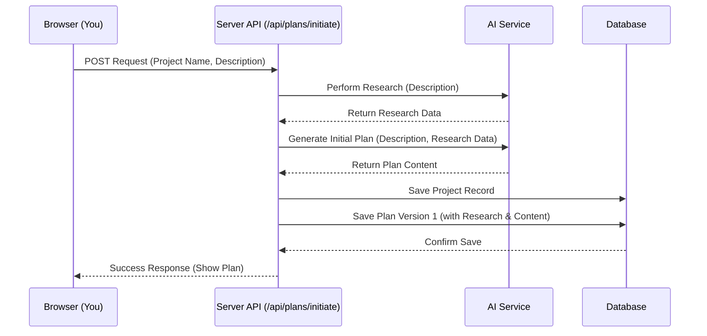
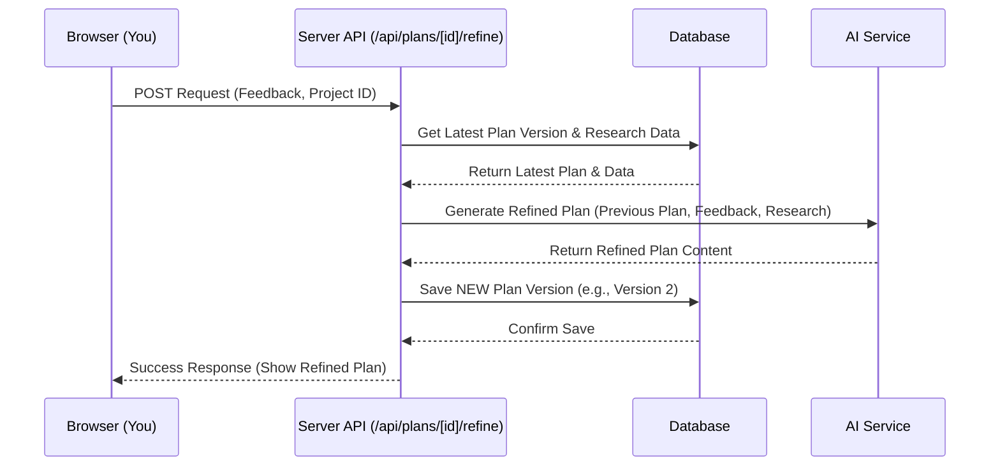

# Chapter 2: Project & Plan Lifecycle

Welcome back! In [Chapter 1: Authentication & Authorization (NextAuth)](01_authentication___authorization__nextauth_.md), we learned how Web-Planner-AI makes sure only you can access your work. Now that you're securely logged in, let's explore the most exciting part: turning your ideas into actual plans with the help of AI!

## What's the Problem? From Fuzzy Idea to Concrete Plan

Imagine you have a brilliant idea for a new website or web application. Maybe it's an online store for handmade crafts, a blog about your travels, or a tool to help people learn a new language.

Just having the idea isn't enough, right? You need a *plan*. What features should it have? Who is it for? How will it work? Doing all this research and structuring the plan can be time-consuming and daunting, especially if you're just starting out.

This is where the **Project & Plan Lifecycle** comes in. It's the core process in Web-Planner-AI designed to take your initial spark of an idea and, with AI assistance, transform it into a well-researched, structured plan that you can refine over time.

Think of it like this:
*   You create a **Project Folder** for your big idea.
*   An AI assistant does some initial **Research** for you.
*   The AI writes the **First Draft** of your plan.
*   You read the draft and give **Feedback**.
*   The AI **Revises** the draft based on your feedback.
*   Each major draft is saved as a separate **Version**, so you can always look back.

This cycle is the heart of Web-Planner-AI. Let's break down the steps.

## The Lifecycle Stages: Step-by-Step

The journey from idea to refined plan follows these key stages:

1.  **Project Creation:**
    *   **What it is:** This is where it all begins! You give your idea a name (e.g., "Travel Blog") and a brief description (e.g., "A blog sharing travel tips and stories from Southeast Asia").
    *   **Analogy:** Creating the main folder on your computer for this new project.
    *   **Result:** The system creates a `Project` entry in the database, linked to your user account.

2.  **AI Deep Research:**
    *   **What it is:** Once the project is created, the AI gets to work behind the scenes. Based on your project description, it researches things like potential target audiences, competitors, relevant keywords, and possible technologies.
    *   **Analogy:** Your super-smart assistant quickly gathering background information and putting it into organized notes.
    *   **Result:** Structured research data (like a digital report) is generated and saved, ready to inform the plan. We'll dive deeper into how this AI magic happens in [Chapter 3: AI Service Interaction](03_ai_service_interaction.md).

3.  **Initial Plan Generation:**
    *   **What it is:** Using your description *and* the research data it just gathered, the AI drafts the first version of your plan. This plan usually includes sections like goals, target audience summary, features, suggested technology, etc.
    *   **Analogy:** The assistant writing the first draft of a proposal document based on the initial idea and the background notes.
    *   **Result:** The very first `Plan` (Version 1) is created and saved in the database, linked to your `Project`.

4.  **User Review & Feedback:**
    *   **What it is:** Now it's your turn! You review the AI's research notes and the initial plan draft. Maybe the AI suggested a feature you don't need, or maybe you want to emphasize a different goal. You provide feedback directly in the app.
    *   **Analogy:** Reading the first draft and adding comments or sticky notes saying "Change this," "Add more about that," or "This part is perfect!"
    *   **Result:** Your feedback text is captured and ready to guide the next revision.

5.  **Plan Refinement:**
    *   **What it is:** You tell the system to refine the plan based on your feedback. The AI takes the *original plan*, the *research data*, and *your specific feedback* to generate an improved version.
    *   **Analogy:** The assistant takes the first draft, reads all your comments, and writes a revised second draft incorporating your changes.
    *   **Result:** A *new* `Plan` (Version 2) is created and saved. Crucially, the old Version 1 is still kept! This process of feedback and refinement can be repeated multiple times.

6.  **Plan Versioning:**
    *   **What it is:** Every time a plan is generated (Initial) or refined, it's saved as a distinct version. This means you have a history of how your plan evolved.
    *   **Analogy:** Instead of saving over the same file, you save each major draft as "Plan_v1.docx", "Plan_v2.docx", "Plan_v3.docx".
    *   **Result:** You can easily switch between and view older versions of your plan. We'll explore this more in [Chapter 4: Plan Versioning](04_plan_versioning.md).

## Following the Flow: A User's Journey

Let's walk through how *you* interact with this lifecycle in the Web-Planner-AI application:

1.  **Create:** You navigate to the "New Plan" page. You enter your "Project Name" and "Project Description" into a form.
2.  **Initiate:** You click a button like "Create & Generate Plan". This triggers the first three stages automatically: Project Creation, AI Research, and Initial Plan Generation. You might see a loading indicator while the AI works.
3.  **Review:** The application displays the Initial Plan (Version 1) and the AI's Research findings. You read through it.
4.  **Feedback:** You find a section for feedback, type in your comments (e.g., "Focus more on mobile users" or "Let's use simpler technology"), and maybe select some AI-generated suggestions.
5.  **Refine:** You click a "Refine Plan" button. This triggers the Plan Refinement stage. Again, you might see a loading indicator.
6.  **View New Version:** The application updates to show the newly generated Refined Plan (Version 2). You can see how your feedback was incorporated.
7.  **Repeat or Accept:** You can provide more feedback and refine again (creating Version 3), or if you're happy, you can proceed to use the plan.

## Under the Hood: How It Works

Let's peek behind the curtain to see the technical flow.

**Simplified Initial Creation Flow:**

When you click "Create & Generate Plan":

1.  **Browser -> Server:** Your browser sends the project name and description to a specific web address on the server (an API endpoint).
2.  **Server -> AI Service:** The server asks the dedicated [AI Service Interaction](03_ai_service_interaction.md) component to perform research and generate the initial plan based on the description.
3.  **AI Service -> Server:** The AI service returns the research data and the generated plan text.
4.  **Server -> Database:** The server saves the new `Project` and the first `Plan` (version 1), including the research data, into the database using [Database Management (Prisma)](07_database_management__prisma_.md).
5.  **Server -> Browser:** The server tells your browser that everything was successful and provides the data for the new plan so it can be displayed.

Here's a diagram showing the initial creation:



**Simplified Refinement Flow:**

When you click "Refine Plan":

1.  **Browser -> Server:** Your browser sends your feedback and the ID of the project to a different API endpoint.
2.  **Server -> Database:** The server fetches the latest `Plan` version and the original `Project` description from the database.
3.  **Server -> AI Service:** The server asks the AI service to generate a *refined* plan, providing the previous plan, your feedback, and the original research data.
4.  **AI Service -> Server:** The AI service returns the new, refined plan text.
5.  **Server -> Database:** The server saves this as a *new* `Plan` version (e.g., version 2) linked to the same project.
6.  **Server -> Browser:** The server confirms success and provides the data for the refined plan.



### Code Sneak Peek: Creating the Project & Initial Plan

This is a simplified look at the code on the server that handles the initial creation request. It shows the main steps: get data, call AI, save to database.

```typescript
// File: app/api/plans/initiate/route.ts (simplified)
import { NextResponse } from 'next/server';
import { prisma } from '@/prisma/client'; // Our DB tool
import { performDeepResearch, generateInitialPlan } from '@/lib/ai-service'; // AI functions
import { PlanType } from '@prisma/client';

export async function POST(request: Request) {
  // 1. Get user input (project name, description) from the request
  const { projectName, projectDescription } = await request.json();
  const userId = /* ... get current user ID ... */; // From session (Chapter 1)

  try {
    // 2. Call the AI service for research
    const researchData = await performDeepResearch(projectDescription);
    if (!researchData) throw new Error("AI Research failed");

    // 3. Call the AI service for the initial plan
    const initialPlanContent = await generateInitialPlan(projectDescription, researchData);
    if (!initialPlanContent) throw new Error("AI Plan generation failed");

    // 4. Save everything to the database
    const newProject = await prisma.project.create({
      data: {
        projectName: projectName,
        projectDescription: projectDescription,
        userId: userId,
        plans: { // Create the first plan linked to this project
          create: {
            planType: PlanType.INITIAL, // Mark as initial
            versionNumber: 1,          // It's version 1
            planContent: JSON.stringify(initialPlanContent), // Save plan
            researchData: researchData as any, // Save research
          },
        },
      },
      include: { plans: true }, // Send the new plan back
    });

    // 5. Send a success response back to the browser
    return NextResponse.json(newProject, { status: 201 });

  } catch (error) {
    // Handle errors if AI or DB fails
    console.error('Error initiating plan:', error);
    return NextResponse.json({ message: 'Failed to initiate plan' }, { status: 500 });
  }
}
```

**Explanation:**
*   The code receives the project name and description.
*   It calls `performDeepResearch` and `generateInitialPlan` from our [AI Service Interaction](03_ai_service_interaction.md) library.
*   It uses `prisma.project.create` from [Database Management (Prisma)](07_database_management__prisma_.md) to save the new project and its very first plan (`versionNumber: 1`, `planType: INITIAL`).
*   It sends the newly created project and plan back to the browser.

### Code Sneak Peek: Refining the Plan

This is a simplified look at the server code that handles refining a plan based on feedback.

```typescript
// File: app/api/plans/[id]/refine/route.ts (simplified)
import { NextResponse } from 'next/server';
import { prisma } from '@/prisma/client';
import { generateRefinedPlan } from '@/lib/ai-service';
import { PlanType } from '@prisma/client';

export async function POST(request: Request, { params }: { params: { id: string } }) {
  // 1. Get feedback and project ID from the request
  const { userFeedback } = await request.json();
  const projectId = params.id; // The ID of the project being refined
  const userId = /* ... get current user ID ... */;

  try {
    // 2. Fetch the latest plan version for this project from DB
    const latestPlan = await prisma.plan.findFirst({
      where: { projectId: projectId, project: { userId: userId } }, // Ensure ownership
      orderBy: { versionNumber: 'desc' },
    });
    if (!latestPlan) throw new Error("Latest plan not found");

    // Also fetch project description (might be needed by AI)
    const project = await prisma.project.findUnique({ where: { id: projectId }});

    // 3. Call AI service to generate a refined plan
    const refinedPlanContent = await generateRefinedPlan(
      project?.projectDescription || '',
      JSON.parse(latestPlan.planContent as string), // Previous content
      userFeedback,                              // Your feedback
      latestPlan.researchData as any             // Original research
    );
    if (!refinedPlanContent) throw new Error("AI refinement failed");

    // 4. Create a NEW Plan record for the refined version
    const newVersionNumber = latestPlan.versionNumber + 1;
    const newPlanVersion = await prisma.plan.create({
      data: {
        projectId: projectId,
        planType: PlanType.REFINED, // Mark as refined
        versionNumber: newVersionNumber, // Increment version
        planContent: JSON.stringify(refinedPlanContent), // Save new content
        researchData: latestPlan.researchData, // Carry over research
        triggeringFeedbackText: userFeedback, // Store feedback that led here
      },
    });

    // 5. Send success response
    return NextResponse.json(newPlanVersion, { status: 200 });

  } catch (error) {
    console.error(`Error refining project ${projectId}:`, error);
    return NextResponse.json({ message: 'Failed to refine plan' }, { status: 500 });
  }
}
```

**Explanation:**
*   The code receives the user's feedback and the ID of the project.
*   It finds the *latest* existing plan for that project in the database.
*   It calls `generateRefinedPlan` from the [AI Service Interaction](03_ai_service_interaction.md), giving it the old plan, the new feedback, and the research data.
*   It saves the result as a *new* plan entry using `prisma.plan.create`, incrementing the `versionNumber` and setting the `planType` to `REFINED`. This relates directly to [Plan Versioning](04_plan_versioning.md).
*   The specific API route structure (`/api/plans/...`) is handled by [API Endpoints (Next.js API Routes)](06_api_endpoints__next_js_api_routes_.md).

## Conclusion

The Project & Plan Lifecycle is the core workflow that makes Web-Planner-AI useful. It provides a structured way to go from a simple idea to a detailed, AI-researched plan. By breaking the process into stages – **Project Creation**, **AI Research**, **Initial Plan**, **Feedback**, and **Refinement** – and saving each iteration with **Versioning**, it allows you to build and improve your plan collaboratively with the AI assistant.

Understanding this lifecycle is key to understanding how the application functions. But how does the AI *actually* do the research and generate the plan text?

**Next Up:** We'll delve into the specifics of communicating with the AI model in [Chapter 3: AI Service Interaction](03_ai_service_interaction.md).

---

Generated by [AI Codebase Knowledge Builder](https://github.com/The-Pocket/Tutorial-Codebase-Knowledge)