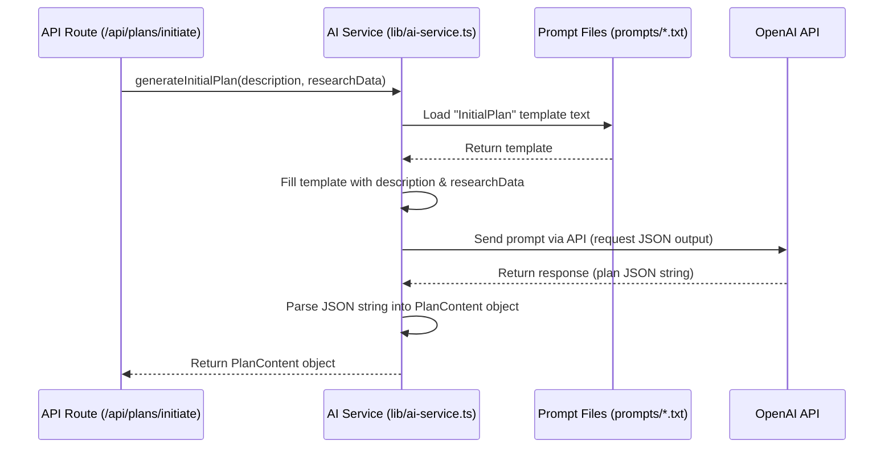

# Chapter 3: AI Service Interaction

Welcome back! In [Chapter 2: Project & Plan Lifecycle](02_project___plan_lifecycle.md), we saw how Web-Planner-AI uses AI to perform research and generate the first draft of your plan. It felt a bit like magic, right? You give it an idea, and it comes back with research and a plan.

But how does our application *actually* talk to the powerful AI models (like OpenAI's GPT) that do this heavy lifting? That's what this chapter is all about! We'll explore the "AI Service Interaction" component – think of it as the brain's interface to the outside AI world.

## What's the Problem? Talking to an External AI Brain

Imagine you want to ask a super-smart expert (the AI model) to do some work for you, like researching competitors for your new website idea or drafting a business plan section. You can't just shout your request into the void! You need a clear way to:

1.  **Ask the Right Question:** How do you phrase your request so the AI understands *exactly* what you need? A vague question gets a vague answer.
2.  **Send the Request:** How does your application actually send this question over the internet to the AI service (like OpenAI)?
3.  **Understand the Answer:** The AI will send back a response, often as raw text or structured data (like JSON). How does your application make sense of this and use it effectively?

Doing this directly from every part of our application that needs AI help would be messy and repetitive. We need a central, organized way to handle all AI communication.

## The Solution: A Dedicated AI Translator and Manager

This is where the **AI Service Interaction** component comes in. It's a specific part of our codebase (`lib/ai-service.ts`) dedicated to handling *all* communication with external AI models.

**Analogy:** Think of the AI Service Interaction component like a specialized **Project Manager** who works exclusively with AI consultants (the external AI models).

*   **It Knows How to Ask:** When another part of our app (like an [API Endpoint](06_api_endpoints__next_js_api_routes_.md)) needs AI help, it tells the AI Service Manager, "I need research on *this* topic" or "Draft a plan section about *this*". The Manager knows the specific format and instructions (the **prompt**) the AI consultant prefers for each task.
*   **It Handles Communication:** The Manager takes the request, formats it perfectly, sends it off to the AI consultant's office (the AI's API endpoint over the internet), and waits for the reply.
*   **It Processes the Results:** When the AI consultant sends back their work (the response), the Manager checks it, cleans it up if necessary (e.g., ensuring it's valid JSON data), and hands the useful, structured information back to the part of the application that originally asked for it.

This keeps the rest of our application clean. Other components don't need to know the messy details of AI communication; they just talk to our friendly AI Service Manager.

## Key Concepts in AI Interaction

Let's break down the main jobs of our AI Service Manager:

1.  **Prompt Engineering (Asking Smart Questions):**
    *   This is the art and science of crafting effective instructions (prompts) for the AI.
    *   Our AI Service stores templates for different tasks (like "Deep Research", "Initial Plan Generation", "Refine Plan").
    *   When a request comes in, it fills in the blanks in the template with specific details (like your project description).
    *   Example: A template might say, "Research competitors for a website about `[PROJECT DESCRIPTION]`. Provide details on `[SPECIFIC POINTS]`. Format the output as JSON." The service replaces the bracketed parts.

2.  **API Communication (Sending & Receiving):**
    *   The service uses a library (like `openai-node`) to securely send the crafted prompt to the AI provider's web address (API).
    *   It handles things like including our secret API key to prove we're allowed to use the service (related to [Authentication & Authorization (NextAuth)](01_authentication___authorization__nextauth_.md) but for AI services).
    *   It waits for the AI to process the request and send back the response.

3.  **Response Processing (Making Sense of the Answer):**
    *   AI responses can vary. Sometimes we ask for structured JSON data, other times plain text.
    *   The service needs to handle the response appropriately. If it expects JSON, it tries to parse the text into a usable data object.
    *   It might also do basic cleanup or validation to ensure the data is usable before returning it.

## How Our App Uses the AI Service

Let's revisit the "Initial Plan Generation" flow from Chapter 2. The [API Endpoint](06_api_endpoints__next_js_api_routes_.md) that handles the `/api/plans/initiate` request needs to coordinate the AI work. Here's a simplified view of how it uses the AI Service:

```typescript
// File: app/api/plans/initiate/route.ts (Simplified)

import { NextResponse } from 'next/server';
// Import functions from our AI Service Manager!
import { performDeepResearch, generateInitialPlan } from '@/lib/ai-service';
import { prisma } from '@/prisma/client'; // For DB saving
// ... other imports

export async function POST(request: Request) {
  // 1. Get project details from the user's request
  const { projectName, projectDescription, ... } = await request.json();
  // ... get userId ...

  try {
    // 2. Ask the AI Service Manager to do research
    console.log("Asking AI Service to perform research...");
    const researchData = await performDeepResearch(projectDescription);
    if (!researchData) throw new Error("AI Research failed");
    console.log("AI Service returned research data.");

    // 3. Ask the AI Service Manager to generate the initial plan
    console.log("Asking AI Service to generate initial plan...");
    const initialPlanContent = await generateInitialPlan(projectDescription, researchData);
    if (!initialPlanContent) throw new Error("AI Plan generation failed");
    console.log("AI Service returned initial plan content.");

    // 4. Save the results to the database (using Prisma from Chapter 7)
    // ... prisma.project.create({ ... data: { ..., planContent: JSON.stringify(initialPlanContent), researchData: researchData } ... }) ...

    // 5. Send success response back to the browser
    return NextResponse.json({ message: 'Success!' }, { status: 201 });

  } catch (error) {
    console.error('Error:', error);
    return NextResponse.json({ message: 'Failed' }, { status: 500 });
  }
}
```

**Explanation:**
*   Notice how this API route *doesn't* know how to talk to OpenAI directly.
*   It simply imports `performDeepResearch` and `generateInitialPlan` from our AI Service (`@/lib/ai-service`).
*   It calls these functions, passing the necessary information (like `projectDescription` and `researchData`).
*   It trusts the AI Service to handle the complex communication and just waits for the structured result (`researchData` object or `initialPlanContent` object).

## Under the Hood: A Look Inside `lib/ai-service.ts`

Let's peek behind the curtain and see how the `generateInitialPlan` function inside `lib/ai-service.ts` might work.

**Step-by-Step Flow:**

1.  **Request Received:** The `generateInitialPlan` function is called with the `projectDescription` and `researchData`.
2.  **Load Prompt Template:** It reads a pre-written instruction file (e.g., `prompts/generateInitialPlanInstructions.txt`). This file contains the detailed prompt asking the AI to create a plan, with placeholders for the specific details.
3.  **Inject Data:** It replaces the placeholders in the template with the actual `projectDescription` and `researchData` (formatted as text, maybe JSON).
4.  **Call AI API:** It uses the `openai` library to send the completed prompt to the specified OpenAI model (e.g., `gpt-4-turbo`). It requests the response in JSON format.
5.  **Receive Response:** OpenAI processes the request and sends back the generated plan, hopefully as a JSON string.
6.  **Parse Response:** The function takes the JSON string response from OpenAI and uses `JSON.parse()` to turn it into a usable JavaScript object (`PlanContent`). It includes error handling in case the AI didn't return valid JSON.
7.  **Return Result:** It returns the parsed `PlanContent` object back to the API route that called it.

**Sequence Diagram:**

This diagram shows the interaction when generating the initial plan:



**Simplified Code Example (`generateInitialPlan`):**

```typescript
// File: lib/ai-service.ts (Simplified)

import OpenAI from 'openai';
import fs from 'fs'; // To read prompt files
import path from 'path'; // To find prompt files
import { PlanContent, ResearchData } from '@/lib/types'; // Our custom types

// Initialize the OpenAI client (needs API key from environment)
const openai = new OpenAI({ apiKey: process.env.OPENAI_API_KEY });

// Function to generate the initial plan
export async function generateInitialPlan(
  projectDescription: string,
  researchData: ResearchData
): Promise<PlanContent | null> { // Returns PlanContent object or null on error
  console.log("AI Service: Generating initial plan...");

  try {
    // 1. Load the prompt template from a file
    const templatePath = path.join(process.cwd(), 'prompts', 'generateInitialPlanInstructions.txt');
    let promptTemplate = fs.readFileSync(templatePath, 'utf-8');

    // 2. Inject specific data into the template
    const researchString = JSON.stringify(researchData, null, 2); // Format research data
    let prompt = promptTemplate.replace('${projectDescription}', projectDescription);
    prompt = prompt.replace('${researchDataString}', researchString);

    // 3. Call the OpenAI API
    const completion = await openai.chat.completions.create({
      model: 'gpt-4-turbo', // Specify the AI model
      messages: [{ role: 'user', content: prompt }], // Send the completed prompt
      response_format: { type: "json_object" }, // Ask for JSON output
      // max_tokens: 3000, // Limit response length (optional)
    });

    // 4. Get the response content
    const responseContent = completion.choices[0]?.message?.content;
    if (!responseContent) throw new Error("AI returned empty content.");

    // 5. Parse the JSON response
    const planData = JSON.parse(responseContent) as PlanContent;
    console.log("AI Service: Initial plan generated and parsed successfully.");

    // 6. Return the parsed plan object
    return planData;

  } catch (error) {
    console.error("AI Service Error (generateInitialPlan):", error);
    return null; // Return null if anything went wrong
  }
}
```

**Explanation:**
*   We import necessary libraries like `OpenAI`, `fs`, and `path`.
*   We load the prompt text from a separate file (`.txt`). This keeps our code cleaner than having huge instruction strings directly in the code.
*   We replace placeholders like `${projectDescription}` in the template with the actual data.
*   We call `openai.chat.completions.create`, sending the final `prompt` and asking for a `json_object` response.
*   We extract the text content from the AI's response.
*   Crucially, we use `JSON.parse()` to convert the AI's text response (which *should* be JSON) into a usable JavaScript object (`PlanContent`).
*   If any step fails (reading file, calling API, parsing JSON), the `catch` block logs the error and returns `null`.

The other functions in `lib/ai-service.ts` (like `performDeepResearch`, `generateRefinedPlan`, `generateImplementationPrompts`) follow a similar pattern: load a specific template, inject data, call the AI, and process the response according to the task's needs.

## Conclusion

The **AI Service Interaction** component (`lib/ai-service.ts`) acts as a vital bridge between our Web-Planner-AI application and powerful external AI models. By centralizing prompt engineering, API communication, and response processing, it provides a clean and manageable way for different parts of our application to leverage AI capabilities like research and content generation. It's the dedicated manager ensuring our requests to the AI are clear and the AI's responses are understood and useful.

Now that we understand how plans are generated using AI, how do we manage different versions of these plans as we refine them with feedback?

**Next Up:** We'll explore how the application keeps track of plan history in [Chapter 4: Plan Versioning](04_plan_versioning.md).

---

Generated by [AI Codebase Knowledge Builder](https://github.com/The-Pocket/Tutorial-Codebase-Knowledge)