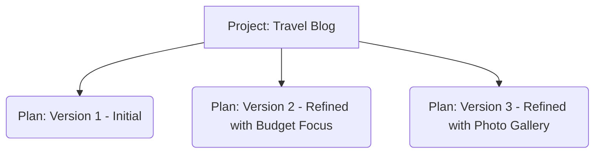
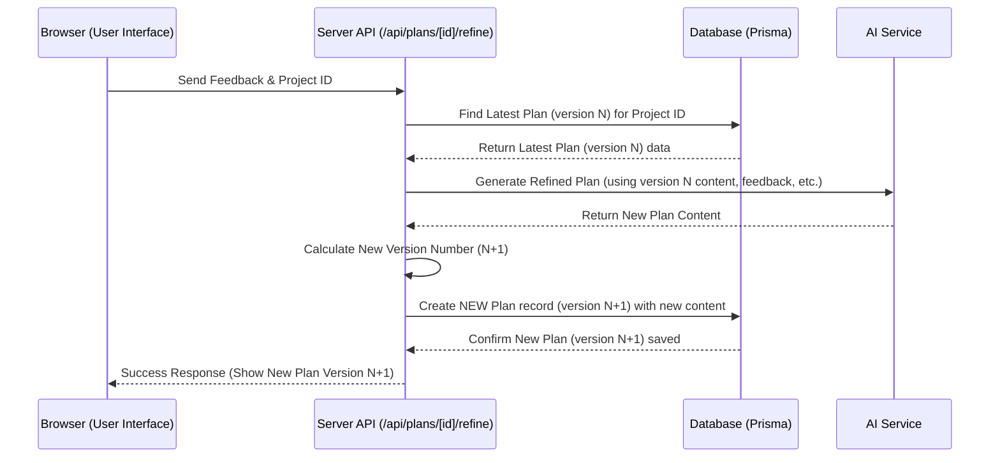

# Chapter 4: Plan Versioning

Welcome back! In [Chapter 3: AI Service Interaction](03_ai_service_interaction.md), we saw how our application talks to AI models to generate the actual content of your project plans. But what happens when you get the first plan back, review it, and ask the AI to make changes based on your feedback? Do we just throw away the old plan?

## What's the Problem? Losing Your History!

Imagine you're working on a plan for your amazing "Travel Blog" project. The AI generates the first version (Version 1). It's pretty good, but you give some feedback: "Focus more on budget travel tips." The AI creates a new plan incorporating your feedback.

Later, you think, "Hmm, maybe the first version's broader approach was better after all." If the application simply *overwrote* Version 1 with the new plan, your original ideas would be lost forever! You wouldn't be able to compare the different approaches or easily go back if you changed your mind.

We need a way to keep track of how the plan evolves over time.

## The Solution: Saving Every Draft as a Version

This is where **Plan Versioning** comes in! It's like hitting "Save As..." instead of just "Save" for every major change to your plan.

**Analogy:** Think about writing an important document, like an essay or a report. You might save different drafts: `Essay_Draft_1.docx`, `Essay_Draft_2_with_feedback.docx`, `Essay_Final.docx`. Plan Versioning does something similar automatically *inside* the Web-Planner-AI application.

Instead of overwriting the old plan content, every time you refine your plan based on feedback, the system:

1.  Takes your feedback and the *previous* plan version.
2.  Asks the [AI Service Interaction](03_ai_service_interaction.md) to generate a *new* plan incorporating the changes.
3.  Saves this new plan as a separate **Plan Version** linked to your original project.
4.  Increments a `versionNumber` so you know which version came after which (e.g., Version 1, Version 2, Version 3...).

This way, you build a complete history of your plan's development.

## How It Works: New Versions, Not Overwrites

The core idea relies on how we store data in our database ([Database Management (Prisma)](07_database_management__prisma_.md)). We have a `Project` table and a `Plan` table.

*   A `Project` represents your overall idea (e.g., "Travel Blog").
*   Each record in the `Plan` table represents a *specific version* of the plan for that project.



**Key Database Fields in the `Plan` Table:**

*   `projectId`: Connects this plan version back to the main `Project`. (Many Plans can belong to one Project).
*   `versionNumber`: A number (1, 2, 3...) indicating the order of this version.
*   `planContent`: The actual text and structure of the plan *for this specific version*.
*   `planType`: Tells us if this was the `INITIAL` plan or a `REFINED` one.
*   `createdAt`: The date and time this specific version was created.
*   `triggeringFeedbackText` (Optional): Stores the feedback you gave that resulted in *this* refined version being created.

When you ask to refine Plan Version 2, the system doesn't change the Version 2 record. It creates a *new* record: Version 3.

## Using Plan Versions

In the Web-Planner-AI application, you'll typically see:

1.  **Current Version:** The latest version of your plan is displayed by default.
2.  **Version History:** A list or dropdown showing all available versions (e.g., "Version 1 (Initial)", "Version 2 (Refined)", "Version 3 (Refined)").
3.  **Viewing Old Versions:** You can select an older version from the list to view its content. This is great for comparison or remembering past ideas.

*(Note: Actually reverting the "current" version back to an older one might be an advanced feature, but simply viewing old versions is the core benefit).*

## Code Sneak Peek: Creating a New Version (Refinement)

Let's look at a simplified piece of the code that handles plan refinement, focusing on how the new version is saved. This happens in one of our [API Endpoints (Next.js API Routes)](06_api_endpoints__next_js_api_routes_.md).

```typescript
// File: app/api/plans/[id]/refine/route.ts (simplified snippet)
import { prisma } from '@/prisma/client';
import { generateRefinedPlan } from '@/lib/ai-service';
import { PlanType } from '@prisma/client';

// ... inside the PUT request handler ...

// 1. Find the *latest* existing plan for the project
const latestPlan = await prisma.plan.findFirst({
  where: { projectId: projectId },
  orderBy: { versionNumber: 'desc' }, // Get the highest version number
});

if (!latestPlan) {
    // Handle error: No previous plan found
}

// 2. Call the AI to generate the new content
const refinedPlanContent = await generateRefinedPlan(
    // ... inputs: previous plan, feedback, research ...
);

if (!refinedPlanContent) {
    // Handle error: AI failed
}

// 3. Calculate the new version number
const newVersionNumber = latestPlan.versionNumber + 1;

// 4. Create a *NEW* Plan record in the database
const newPlanVersion = await prisma.plan.create({
  data: {
    projectId: projectId, // Link to the same project
    planType: PlanType.REFINED, // Mark as refined
    versionNumber: newVersionNumber, // Use the incremented number
    planContent: JSON.stringify(refinedPlanContent), // Save the new content
    researchData: latestPlan.researchData, // Often carry over research
    triggeringFeedbackText: userFeedback, // Store the feedback used
  },
});

// 5. Send the new plan version back to the user interface
return NextResponse.json(newPlanVersion, { status: 200 });

// ... error handling ...
```

**Explanation:**
*   We first find the plan with the highest `versionNumber` for the current project.
*   After the AI generates the `refinedPlanContent`, we calculate the `newVersionNumber` by adding 1 to the latest version's number.
*   Crucially, we use `prisma.plan.create()` to make a *new row* in the `Plan` table, storing the new content and the incremented version number. We do **not** use `prisma.plan.update()`.

## Code Sneak Peek: Listing Available Versions

How does the user interface get the list of versions to display? It calls another API endpoint. Here's a simplified look at that code:

```typescript
// File: app/api/plans/[id]/versions/route.ts (simplified snippet)
import { prisma } from "@/lib/prisma";

// ... inside the GET request handler ...

const projectId = /* ... get project ID from the request URL ... */;
const userId = /* ... get user ID from session ... */;

// 1. Find the project first to check ownership (security!)
const project = await prisma.project.findUnique({
    where: { id: projectId },
    select: { userId: true },
});

// 2. Check if project exists and belongs to the current user
if (!project || project.userId !== userId) {
    // Return error (Not Found or Forbidden)
}

// 3. Find ALL plans linked to this project ID
const versions = await prisma.plan.findMany({
  where: {
    projectId: projectId, // Filter by the project
  },
  orderBy: {
    versionNumber: 'desc', // Show latest versions first
  },
  select: { // Only pick the fields needed for the list
    id: true,
    versionNumber: true,
    planType: true,
    createdAt: true,
  },
});

// 4. Send the list of versions back to the user interface
return NextResponse.json(versions);

// ... error handling ...
```

**Explanation:**
*   After checking that the user owns the project, the code uses `prisma.plan.findMany()` to get *all* `Plan` records associated with the given `projectId`.
*   It orders them by `versionNumber` (usually descending, so the newest is first).
*   It selects only the necessary fields (`id`, `versionNumber`, `planType`, `createdAt`) to keep the data transfer small.
*   This list is then sent back to the frontend, which can display it to the user.

## Under the Hood: The Refinement Flow with Versioning

Let's visualize the process when a user refines a plan:



**Steps:**

1.  **Feedback Sent:** The user submits feedback via the Browser.
2.  **Fetch Latest:** The Server API receives the feedback and asks the Database for the most recent `Plan` version for that project.
3.  **AI Refinement:** The API sends the previous plan content, feedback, and other necessary info to the AI Service to generate the refined version.
4.  **Calculate Version:** The API calculates the next version number (e.g., if the latest was 2, the new one is 3).
5.  **Create New Record:** The API tells the Database to **create** a completely new `Plan` record, saving the AI's refined content and the new version number.
6.  **Confirmation:** The Database confirms the new record is saved.
7.  **Display Update:** The API informs the Browser that the refinement was successful, and the Browser displays the new plan version (Version N+1).

The key takeaway is step 5: **Create NEW Plan record**. This is the heart of versioning.

## Conclusion

Plan Versioning is a simple but powerful mechanism in Web-Planner-AI. By saving each refined plan as a new version instead of overwriting the old one, it provides a safety net, allowing you to track the evolution of your ideas, compare different drafts, and refer back to previous stages without losing any work. It leverages the relationship between `Project` and `Plan` models in our database, primarily by incrementing a `versionNumber` and creating new `Plan` records for each refinement using `prisma.plan.create`.

This ensures that your planning process is well-documented and flexible. But what if you want to generate a plan quickly without the back-and-forth refinement?

**Next Up:** We'll explore a feature designed for quick, targeted plan generation in [Chapter 5: One-Shot Prompt Feature](05_one_shot_prompt_feature.md).

---

Generated by [AI Codebase Knowledge Builder](https://github.com/The-Pocket/Tutorial-Codebase-Knowledge)