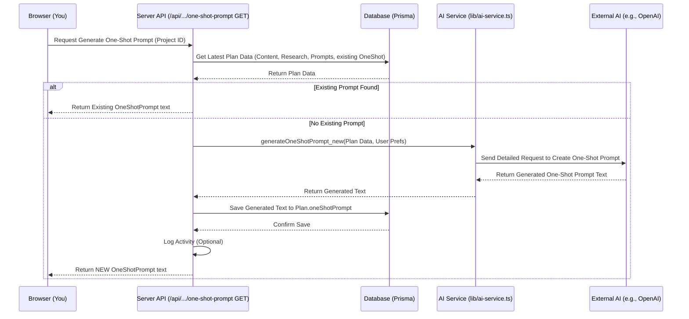

# Chapter 5: One-Shot Prompt Feature

Welcome back! In [Chapter 4: Plan Versioning](04_plan_versioning.md), we learned how Web-Planner-AI keeps track of every draft of your plan, creating a helpful history. Now, let's explore a really cool, advanced feature: the **One-Shot Prompt**.

## What's the Problem? Handing Off the Entire Plan for Building

Imagine you've gone through the planning process, refining your ideas with the AI's help, and you have a final plan version you're happy with. The next step is actually *building* the website or application.

While Web-Planner-AI can generate implementation prompts (like a checklist of coding tasks), what if you want to hand off the *entire* project blueprint to another powerful AI, like an AI coding assistant or a tool that generates code automatically? How can you give it *all* the necessary instructions in one go?

Simply copying and pasting the plan text isn't enough. The coding AI needs more: the research data, the specific steps, instructions tailored to its capabilities, details about your preferred technology, etc. Creating this comprehensive instruction set manually would be tedious and error-prone.

## The Solution: The "One-Shot" Master Blueprint

The **One-Shot Prompt** feature is designed to solve exactly this! It's like creating a **master blueprint and a super-detailed instruction manual all rolled into one massive document**.

Here's the idea:

1.  **Gather Everything:** Web-Planner-AI collects all the crucial information from your finalized plan:
    *   The main plan content (`planContent`).
    *   The background research data (`researchData`).
    *   The categorized implementation prompts (`prompts`) generated previously (which act like a task list).
    *   Potentially, user preferences or project settings (like preferred coding language or target AI code editor).
2.  **Ask the AI (Again!):** It then uses our [AI Service Interaction](03_ai_service_interaction.md) component to ask an AI model (like GPT-4) to *synthesize* all this information into a single, large, highly structured prompt.
3.  **Tailor the Output:** This "One-Shot Prompt" is specifically designed to be understood by *another* AI (like GitHub Copilot, Cursor, or other code-generating tools). It instructs that AI on how to build the *entire* application, step-by-step, based on your plan.
4.  **Refine and Use:** You can review this generated One-Shot Prompt and even provide feedback to refine it further. Once ready, you can copy this massive prompt and paste it into your favorite AI coding assistant to kickstart the development process.

Think of it as commissioning a detailed set of instructions for an automated construction robot (the AI code editor) to build your entire house based on the final architectural plans.

## How to Use the One-Shot Prompt Feature

Using this feature is straightforward, although it's considered more advanced:

1.  **Navigate:** Go to the details page for the project plan you want to implement. Make sure you're viewing the plan version you intend to use (usually the latest).
2.  **Find the Feature:** Look for a section likely titled "Implementation Prompts" or similar. Within this section, you should find a tab or button labeled "One-Shot Prompt".
3.  **Generate:** If the prompt hasn't been created yet, you'll likely see a button like "Generate One-Shot Prompt". Click it. This will trigger the process described above. You might see a loading indicator while the AI works.
4.  **View:** Once generated, the massive One-Shot Prompt text will be displayed in a text area.
5.  **(Optional) Refine:** Read through the prompt. Does it look complete? Is anything unclear? If you want changes, you can type feedback into a nearby input box and click a "Refine Prompt" button. This will ask the AI to adjust the prompt based on your feedback.
6.  **Copy & Use:** When you're satisfied, use the "Copy" button to copy the entire prompt text to your clipboard. You can then paste this into your chosen AI code editor or code generation tool to start the building process.

## Under the Hood: Generating the Master Instructions

Let's peek behind the curtain to see how this generation process works when you click "Generate One-Shot Prompt".

**Step-by-Step Walkthrough:**

1.  **Request:** Your browser sends a request to a specific server address, like `GET /api/plans/[projectId]/one-shot-prompt`. This is handled by our [API Endpoints (Next.js API Routes)](06_api_endpoints__next_js_api_routes_.md).
2.  **Authentication:** The server checks if you're logged in and authorized to access this project ([Authentication & Authorization (NextAuth)](01_authentication___authorization__nextauth_.md)).
3.  **Data Fetching:** The server retrieves the relevant `Plan` data from the database ([Database Management (Prisma)](07_database_management__prisma_.md)). This includes the `planContent`, `researchData`, and any previously generated categorized `prompts`. It also checks if a `oneShotPrompt` field already contains text for this plan.
4.  **Cache Check:** If the `oneShotPrompt` field already has content, the server simply returns that existing prompt to your browser (Step 9).
5.  **AI Service Call:** If no prompt exists, the server calls a specific function within the [AI Service Interaction](03_ai_service_interaction.md) component, likely named `generateOneShotPrompt_new`. It passes the plan content, research data, categorized prompts, and maybe user preferences (like target code editor, e.g., 'vscode').
6.  **AI Generation:** The AI Service function constructs a detailed request for the external AI model (e.g., OpenAI's GPT-4). This request asks the model to create the comprehensive One-Shot Prompt based on all the provided inputs.
7.  **AI Response:** The external AI model processes the request and sends back the generated One-Shot Prompt text.
8.  **Database Save:** The server receives the generated text and saves it into the `oneShotPrompt` field of the specific `Plan` record in the database.
9.  **Activity Logging:** The server might log this event using the [Activity Logging](08_activity_logging.md) system (e.g., `ONESHOT_GENERATED`).
10. **Return Prompt:** The server sends the newly generated (or cached) One-Shot Prompt text back to your browser.
11. **Display:** Your browser displays the received prompt text in the designated area.

**Simplified Sequence Diagram (Generation):**



### Code Sneak Peek: Generating the Prompt (API Route)

Here's a *very simplified* look at the API route that handles the request to get or generate the One-Shot Prompt.

```typescript
// File: app/api/plans/[id]/one-shot-prompt/route.ts (Simplified GET)
import { NextResponse } from 'next/server';
import { prisma } from '@/lib/prisma';
import { generateOneShotPrompt_new } from '@/lib/ai-service';
import { getServerSession } from 'next-auth/next';
import { authOptions } from '@/lib/auth';

export async function GET(request: Request, { params }: { params: { id: string } }) {
  const session = await getServerSession(authOptions);
  const projectId = params.id;
  // Ensure user is logged in (simplified)
  if (!session?.user?.id) return NextResponse.json({ msg: 'Unauthorized' }, { status: 401 });

  try {
    // 1. Fetch latest plan (check ownership - simplified)
    const latestPlan = await prisma.plan.findFirst({
      where: { projectId: projectId, project: { userId: session.user.id } },
      orderBy: { versionNumber: 'desc' },
      select: { id: true, oneShotPrompt: true, planContent: true, researchData: true, prompts: true /* ... */ },
    });

    if (!latestPlan) return NextResponse.json({ msg: 'Plan not found' }, { status: 404 });

    // 2. Return if exists (Type assertion 'as any' used for simplicity here)
    if ((latestPlan as any).oneShotPrompt) {
      return NextResponse.json({ oneShotPrompt: (latestPlan as any).oneShotPrompt });
    }

    // 3. Generate if not exists
    const generatedPrompt = await generateOneShotPrompt_new(
      latestPlan.planContent,
      latestPlan.researchData as any, // Cast JsonValue for simplicity
      latestPlan.prompts as any,     // Cast JsonValue for simplicity
      'vscode', // Example target editor
      { /* db info */ }, // Placeholder
      { /* user profile */ } // Placeholder
    );

    if (!generatedPrompt) throw new Error("AI Generation failed");

    // 4. Save to DB (Type assertion 'as any' used for simplicity here)
    await prisma.plan.update({
      where: { id: latestPlan.id },
      data: { oneShotPrompt: generatedPrompt } as any,
    });

    // 5. Log activity (Simplified)
    // await prisma.activity.create({ ... });

    // 6. Return new prompt
    return NextResponse.json({ oneShotPrompt: generatedPrompt });

  } catch (error) {
    console.error("Error generating One-Shot Prompt:", error);
    return NextResponse.json({ msg: 'Failed' }, { status: 500 });
  }
}
```

**Explanation:**
*   It gets the project ID and checks the user session.
*   It fetches the latest plan data from the [Database Management (Prisma)](07_database_management__prisma_.md).
*   It checks if `oneShotPrompt` already exists. If yes, it returns it.
*   If not, it calls `generateOneShotPrompt_new` from the [AI Service Interaction](03_ai_service_interaction.md), passing the necessary data.
*   It saves the newly generated prompt back to the database.
*   (Optionally logs the activity using [Activity Logging](08_activity_logging.md)).
*   Finally, it returns the generated prompt to the browser.

### Code Sneak Peek: Generating the Prompt (AI Service)

Inside `lib/ai-service.ts`, the `generateOneShotPrompt_new` function does the heavy lifting of talking to the external AI.

```typescript
// File: lib/ai-service.ts (Simplified generateOneShotPrompt_new)
import OpenAI from 'openai';
// ... other imports ...

const openai = new OpenAI({ apiKey: process.env.OPENAI_API_KEY });

export async function generateOneShotPrompt_new(
  planContent: string | null,
  researchData: any, // Simplified type
  implementationPrompts: any, // Simplified type
  codeEditor: string,
  databaseInfo: any,
  userProfile: any
): Promise<string | null> {
  console.log(`Generating One-Shot Prompt for Editor: ${codeEditor}`);

  // 1. Construct the detailed prompt for the *external* AI
  const detailedPrompt = `
    You are an expert AI programming assistant. Generate a single, comprehensive "One-Shot Prompt"
    to build an entire web application using ${codeEditor}.

    **Project Context:**
    - Plan: ${planContent || 'N/A'}
    - Research: ${JSON.stringify(researchData) || 'N/A'}
    - Tasks: ${JSON.stringify(implementationPrompts) || 'N/A'}
    - DB: ${JSON.stringify(databaseInfo) || 'N/A'}
    - User Prefs: ${JSON.stringify(userProfile) || 'N/A'}

    **Instructions:**
    - Structure the prompt logically (Setup, Backend, Frontend, etc.).
    - Provide extremely detailed, step-by-step instructions.
    - Include code snippets, file names, API definitions.
    - Tailor for ${codeEditor}.
    - Output only the final, complete One-Shot Prompt text.

    Generate the prompt now.
  `;

  try {
    // 2. Call the external AI API (e.g., OpenAI)
    const completion = await openai.chat.completions.create({
      model: 'gpt-4-turbo', // Powerful model needed
      messages: [{ role: 'user', content: detailedPrompt }],
      max_tokens: 4096, // Allow large output
    });

    // 3. Extract and return the generated text
    const oneShotPromptContent = completion.choices[0]?.message?.content;
    if (!oneShotPromptContent) throw new Error("AI returned empty content.");

    console.log("One-Shot Prompt content generated by external AI.");
    return oneShotPromptContent;

  } catch (error) {
    console.error("Error calling external AI for One-Shot Prompt:", error);
    return null;
  }
}
```

**Explanation:**
*   This function receives all the necessary data (plan, research, etc.).
*   It creates a very specific, detailed prompt (`detailedPrompt`) that instructs the *external* AI (like OpenAI) on *how to create* the One-Shot Prompt itself.
*   It calls the external AI using the `openai` library.
*   It extracts the text response from the AI and returns it.

### Refining the Prompt

When you provide feedback and click "Refine Prompt", a similar process occurs:

1.  A `PUT` request is sent to `/api/plans/[projectId]/one-shot-prompt` with your feedback text.
2.  The API fetches the *existing* `oneShotPrompt` from the database.
3.  It calls `refineOneShotPrompt` in the [AI Service Interaction](03_ai_service_interaction.md), passing the existing prompt and your feedback.
4.  The AI service asks the external AI to modify the prompt based on the feedback.
5.  The refined prompt is returned, saved back to the database (overwriting the previous One-Shot Prompt for that plan version), and displayed to you.

## Conclusion

The **One-Shot Prompt** is an advanced feature in Web-Planner-AI that acts as a bridge between your finalized plan and external AI coding tools. By consolidating the plan, research, and implementation steps into a single, massive, tailored instruction set, it allows you to leverage powerful code generation AIs to build your entire application based on the plan you carefully crafted. The system uses the [AI Service Interaction](03_ai_service_interaction.md) to generate and refine this prompt, storing the result in the [Database Management (Prisma)](07_database_management__prisma_.md) system associated with your specific plan version.

Understanding how this feature works involves seeing how different parts of the application collaborate: the frontend UI triggers the request, the [API Endpoints (Next.js API Routes)](06_api_endpoints__next_js_api_routes_.md) orchestrate the process, the [Database Management (Prisma)](07_database_management__prisma_.md) stores the data, and the [AI Service Interaction](03_ai_service_interaction.md) handles the communication with external AI models.

**Next Up:** We'll take a closer look at how the server handles requests like these by exploring [Chapter 6: API Endpoints (Next.js API Routes)](06_api_endpoints__next_js_api_routes_.md).

---

Generated by [AI Codebase Knowledge Builder](https://github.com/The-Pocket/Tutorial-Codebase-Knowledge)