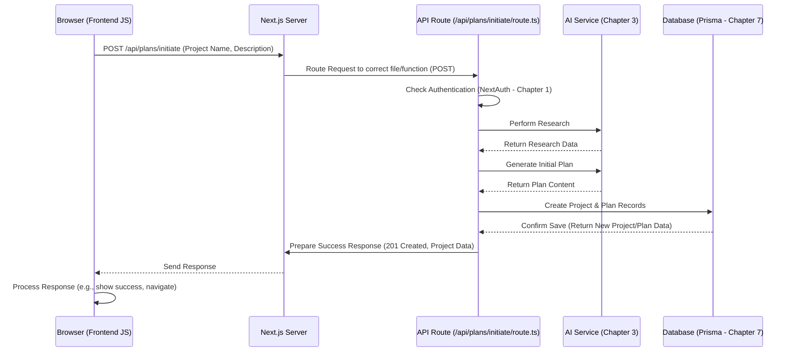

# Chapter 6: API Endpoints (Next.js API Routes)

Welcome back! In [Chapter 5: One-Shot Prompt Feature](05_one_shot_prompt_feature.md), we saw how Web-Planner-AI can bundle up your entire plan into a master instruction set for AI coding assistants. But how does the part of the application running in your browser (the frontend) actually *talk* to the part running on the server (the backend) to make things happen, like generating that prompt, saving your project, or asking the AI for help?

## What's the Problem? Connecting the Browser to the Brain

Imagine your web browser showing you the Web-Planner-AI interface. You fill out the form to create a new project, providing a name and description. You click the "Create Plan" button.

How does this information get from the form in your browser to the server where the actual work happens? The server needs to receive the project details, potentially talk to the [AI Service Interaction](03_ai_service_interaction.md), save the new project in the [Database Management (Prisma)](07_database_management__prisma_.md), and then tell your browser if it was successful.

We need a clear and defined way for the frontend (browser) to send requests and receive responses from the backend (server).

## The Solution: API Endpoints - The Server's Menu and Ordering System

**API Endpoints** are the specific addresses (URLs) on the server that the frontend application communicates with. Each endpoint is designed to handle a specific task.

**Analogy:** Think of a restaurant.
*   The **backend server** is the kitchen.
*   The **API Endpoints** are like the items on the menu and the ordering system.
*   The **frontend (your browser)** is you, the customer.

When you want something done (like creating a new project), the frontend "places an order" (sends a request) to a specific menu item (the API endpoint URL). The kitchen (backend) receives the order, does the work (creates the project, talks to AI, saves to database), and then sends the result (a response, like "Success!" or "Error") back to you.

In Web-Planner-AI, we use a feature of the Next.js framework called **API Routes**. These allow us to easily create these backend endpoints directly within our project structure.

## Key Concepts

1.  **API Endpoint (The Address):**
    *   A specific URL on our server, like `/api/plans/initiate` or `/api/user/profile`.
    *   Each URL corresponds to a specific function or task the backend can perform.

2.  **Next.js API Routes (The Code):**
    *   These are special files typically located in the `app/api/` directory of our project.
    *   For example, the code to handle requests for creating a new plan might live in `app/api/plans/initiate/route.ts`.
    *   This code runs *on the server*, not in the user's browser. It can securely access databases, talk to AI services, etc.

3.  **Request (Placing the Order):**
    *   When the frontend needs something from the backend, it sends an HTTP Request to the endpoint's URL.
    *   This request includes:
        *   **Method:** What kind of action to perform (like `GET` to fetch data, `POST` to create data, `PUT`/`PATCH` to update, `DELETE` to remove).
        *   **Headers:** Extra information (like authentication tokens from [Authentication & Authorization (NextAuth)](01_authentication___authorization__nextauth_.md)).
        *   **Body (Optional):** The actual data being sent (like the project name and description in a `POST` request).

4.  **Response (Getting the Result):**
    *   After the backend code at the API Route finishes its task, it sends an HTTP Response back to the frontend.
    *   This response includes:
        *   **Status Code:** A number indicating success (like `200 OK`, `201 Created`) or failure (`404 Not Found`, `500 Internal Server Error`, `401 Unauthorized`).
        *   **Body (Optional):** The data being sent back (like the details of the newly created project, or an error message).

## How We Use API Routes in Web-Planner-AI

Let's revisit our example: creating a new project.

1.  **User Action:** You fill in the "Project Name" and "Project Description" on the "New Plan" page in your browser and click "Create & Generate Plan".
2.  **Frontend Request:** JavaScript code running in your browser (the frontend) takes the name and description and sends a `POST` request to the `/api/plans/initiate` endpoint.

    ```javascript
    // Simplified Frontend Code (e.g., in a React component)
    async function handleCreatePlan(projectName, projectDescription) {
      const response = await fetch('/api/plans/initiate', {
        method: 'POST', // We are creating something new
        headers: {
          'Content-Type': 'application/json',
          // Authorization headers might be added automatically by middleware/fetch wrappers
        },
        body: JSON.stringify({ // Send the data as JSON
          projectName: projectName,
          projectDescription: projectDescription
        }),
      });

      if (response.ok) {
        const newProjectData = await response.json();
        console.log('Project created!', newProjectData);
        // Navigate to the new project page, show success message, etc.
      } else {
        console.error('Failed to create project:', await response.json());
        // Show an error message to the user
      }
    }
    ```

    *Explanation:* This code uses the browser's built-in `fetch` function to send a `POST` request to our specific API endpoint (`/api/plans/initiate`). It includes the project details in the request `body`. It then checks if the `response` from the server was `ok` (successful).

3.  **Backend Processing:** The Next.js server receives the request. Because the URL starts with `/api/`, it knows to run the code inside `app/api/plans/initiate/route.ts`.

    ```typescript
    // Simplified Backend Code: app/api/plans/initiate/route.ts
    import { NextResponse } from 'next/server';
    import { prisma } from '@/prisma/client'; // Our DB tool from Chapter 7
    import { performDeepResearch, generateInitialPlan } from '@/lib/ai-service'; // Chapter 3
    import { getServerSession } from 'next-auth/next'; // Chapter 1
    import { authOptions } from '@/lib/auth'; // Chapter 1

    export async function POST(request: Request) {
      // 1. Check Authentication (Chapter 1)
      const session = await getServerSession(authOptions);
      if (!session?.user?.id) {
        return NextResponse.json({ message: 'Unauthorized' }, { status: 401 });
      }

      try {
        // 2. Get data from the frontend's request body
        const { projectName, projectDescription } = await request.json();
        if (!projectName || !projectDescription) {
          return NextResponse.json({ message: 'Missing required fields' }, { status: 400 });
        }

        // 3. Call AI services (Chapter 3) - Simplified
        const researchData = await performDeepResearch(projectDescription);
        const initialPlanContent = await generateInitialPlan(projectDescription, researchData);
        // ... add error handling for AI failures ...

        // 4. Save to Database (Chapter 7) - Simplified
        const newProject = await prisma.project.create({
          data: {
            projectName, projectDescription, userId: session.user.id,
            plans: { create: { /* ... plan details ... */ } }
          },
          include: { plans: true }
        });

        // 5. Send Success Response back to frontend
        return NextResponse.json(newProject, { status: 201 }); // 201 = Created

      } catch (error) {
        console.error('Error initiating plan:', error);
        // 6. Send Error Response back to frontend
        return NextResponse.json({ message: 'Internal Server Error' }, { status: 500 });
      }
    }
    ```

    *Explanation:* This server-side code first checks if the user is logged in using `getServerSession` ([Authentication & Authorization (NextAuth)](01_authentication___authorization__nextauth_.md)). It then reads the `projectName` and `projectDescription` sent by the frontend. It calls functions from our [AI Service Interaction](03_ai_service_interaction.md) library and uses [Database Management (Prisma)](07_database_management__prisma_.md) to save the data. Finally, it uses `NextResponse.json()` to send either the successful `newProject` data (with status `201`) or an error message (with status `500`) back to the frontend.

4.  **Frontend Response Handling:** The frontend's `fetch` call receives the response. If `response.ok` is true, it processes the `newProjectData`. If not, it logs the error.

## Under the Hood: The Request-Response Cycle

Let's visualize the flow when the user clicks "Create & Generate Plan":



**Steps:**

1.  **Request:** The Browser sends a `POST` request with the data to the Next.js Server at the `/api/plans/initiate` URL.
2.  **Routing:** The Next.js Server identifies the path starts with `/api/` and directs the request to the code defined in `app/api/plans/initiate/route.ts`, specifically calling the `POST` function within that file.
3.  **Execution:** The API Route code runs on the server:
    *   It verifies the user is logged in ([Authentication & Authorization (NextAuth)](01_authentication___authorization__nextauth_.md)).
    *   It calls the [AI Service Interaction](03_ai_service_interaction.md) to get research and the initial plan.
    *   It interacts with the [Database Management (Prisma)](07_database_management__prisma_.md) to save the new project and plan.
4.  **Response Preparation:** The API Route code finishes and uses `NextResponse.json()` to create a success response containing the new project data and a `201 Created` status code.
5.  **Response Sent:** The Next.js Server sends this response back to the Browser.
6.  **Frontend Update:** The JavaScript code in the browser receives the response, sees the success status, parses the new project data, and updates the user interface accordingly.

All the API endpoints listed in the Project Plan (like `/api/plans/[id]/refine`, `/api/plans/[id]/versions`, `/api/user/profile`) follow this same fundamental pattern: a specific URL maps to a server-side file/function that handles requests for a particular task.

## Conclusion

API Endpoints, implemented in our project using **Next.js API Routes** (`app/api/...`), are the crucial communication channels between the frontend (user's browser) and the backend (server). They act like a well-defined menu, allowing the frontend to request specific actions (`POST`, `GET`, `PUT`, `DELETE`) or data from the server by sending HTTP requests to specific URLs. The server-side code at these endpoints processes the requests, interacts with other services like the AI and database, and sends back HTTP responses indicating success or failure, along with any necessary data. This request-response cycle powers all the dynamic features of Web-Planner-AI.

Now that we've seen how the frontend talks to the backend, and how the backend orchestrates tasks, let's dive deeper into one of the most critical backend components: how we actually store and manage all the project and user data.

**Next Up:** We'll explore the system used for interacting with our database in [Chapter 7: Database Management (Prisma)](07_database_management__prisma_.md).

---

Generated by [AI Codebase Knowledge Builder](https://github.com/The-Pocket/Tutorial-Codebase-Knowledge)