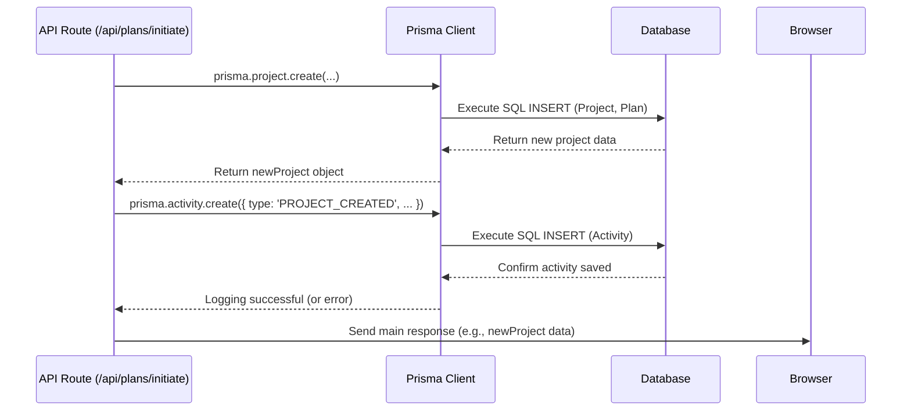

# Chapter 8: Activity Logging

Welcome to the final chapter of our tutorial series! In [Chapter 7: Database Management (Prisma)](07_database_management__prisma_.md), we saw how Web-Planner-AI uses Prisma to store and manage important data like user profiles, projects, and plan versions in our PostgreSQL database. But what about recording *what happens* within the application?

## What's the Problem? Keeping Track of Actions

Imagine you're using Web-Planner-AI, and suddenly a project you were working on seems different, or maybe you want to remember when you asked the AI to refine a specific plan. How can you or an administrator see a history of significant events that occurred? Without a record, it's like trying to remember conversations from weeks ago – details get lost, and it's hard to trace back steps if something goes wrong.

We need a system to:

1.  **Record Events:** Automatically note down important actions performed by users or the system.
2.  **Provide Context:** Store details about *who* did *what*, *when*, and *to which* project or plan.
3.  **Enable Review:** Allow users or administrators to view this history for auditing, debugging, or simply understanding recent activity.

## The Solution: An Application Logbook

**Activity Logging** is Web-Planner-AI's built-in event recorder. It acts like a ship's logbook or a diary for the application.

**Analogy:** Imagine every time something significant happens in our application – like a user creating a new project, refining a plan, changing settings, or even encountering an error – a little note is automatically written down in a special logbook.

This "logbook" is actually a table in our database, typically named `Activity`. Each note (or row in the table) is an **Activity Record** containing details about the event.

## Key Concepts

1.  **Activity Record:**
    *   This is a single entry in the `Activity` database table.
    *   It typically stores:
        *   `type`: What kind of event happened (e.g., `PROJECT_CREATED`, `PLAN_REFINED`, `USER_LOGIN_FAILED`, `PDF_EXPORTED`).
        *   `timestamp`: When the event occurred.
        *   `userId`: Which user triggered the event (if applicable).
        *   `projectId`: Which project was involved (if applicable).
        *   `planId`: Which specific plan version was involved (if applicable).
        *   `details` or `metadata`: Extra information about the event (e.g., "Refined plan version 3 based on feedback", "Exported Plan 'My Project v2' to PDF").

2.  **Trigger Points:**
    *   These are specific places in the server-side code (usually within our [API Endpoints (Next.js API Routes)](06_api_endpoints__next_js_api_routes_.md)) where we decide an event is important enough to log.
    *   Logging usually happens *after* a core action is successfully completed (or if an error occurs). For example, *after* saving a new project to the database, we add the code to log the `PROJECT_CREATED` activity.

3.  **Database Model (`Activity` Table):**
    *   We define the structure of our logbook using our Prisma schema, similar to how we defined `User` and `Project` in [Chapter 7: Database Management (Prisma)](07_database_management__prisma_.md).

    ```prisma
    // File: prisma/schema.prisma (Activity model snippet)

    model Activity {
      id        String    @id @default(cuid())
      type      String    // e.g., "PROJECT_CREATED", "PLAN_REFINED"
      timestamp DateTime  @default(now())
      details   String?   @db.Text // Optional extra info
      metadata  Json?     // Optional structured data

      // Links to other models
      userId    String?   // Which user? (Optional if system action)
      user      User?     @relation(fields: [userId], references: [id], onDelete: SetNull)

      projectId String?   // Which project? (Optional)
      project   Project?  @relation(fields: [projectId], references: [id], onDelete: Cascade) // Cascade delete if project deleted

      planId    String?   // Which plan version? (Optional)
      plan      Plan?     @relation(fields: [planId], references: [id], onDelete: SetNull)

      @@index([userId])
      @@index([projectId])
      @@index([timestamp])
    }

    // Ensure User, Project, Plan models are also defined...
    model User {
      id         String     @id @default(cuid())
      // ... other fields
      activities Activity[] // A user can have many activities
    }
    model Project {
      id         String     @id @default(cuid())
      // ... other fields
      activities Activity[] // A project can have many activities
    }
    model Plan {
      id         String     @id @default(cuid())
      // ... other fields
      activities Activity[] // A plan version can have activities
    }
    ```

    *Explanation:*
    *   We define an `Activity` model with fields like `type`, `timestamp`, `details`.
    *   We use relation fields (`userId`, `projectId`, `planId`) to link the activity back to the relevant user, project, or plan. `@relation(...)` sets up these connections.
    *   `onDelete: Cascade` for `projectId` means if a project is deleted, its related activity logs are also automatically deleted (keeping the database clean). `onDelete: SetNull` for `userId` and `planId` means if the user or plan is deleted, the link in the activity log is just removed (set to null) but the log entry itself remains.

## How to Use: Logging an Activity

Logging is done from the server-side code. We use the Prisma Client, just like we did for creating projects or plans.

Let's look at the API route that creates a new project (`/api/plans/initiate`) from [Chapter 6: API Endpoints (Next.js API Routes)](06_api_endpoints__next_js_api_routes_.md). After successfully saving the new project, we add a line to log the activity.

```typescript
// File: app/api/plans/initiate/route.ts (Simplified - focus on logging)
import { NextResponse } from 'next/server';
import { prisma } from '@/prisma/client'; // Our Prisma Client
import { getServerSession } from 'next-auth/next';
import { authOptions } from '@/lib/auth';
// ... other imports

export async function POST(request: Request) {
  const session = await getServerSession(authOptions);
  if (!session?.user?.id) { /* ... handle unauthorized ... */ }
  const userId = session.user.id;

  try {
    const { projectName, /* ... other fields ... */ } = await request.json();

    // ... (Perform AI research and plan generation) ...

    // Save the new project and initial plan using Prisma
    const newProject = await prisma.project.create({
      data: {
        projectName: projectName,
        userId: userId,
        // ... other project data ...
        plans: { create: { /* ... initial plan data ... */ } },
      },
      include: { plans: true },
    });

    // *** Log the Activity using Prisma Client ***
    try {
      await prisma.activity.create({
        data: {
          type: "PROJECT_CREATED", // The type of event
          userId: userId,         // Link to the user
          projectId: newProject.id, // Link to the new project
          details: `Created project "${projectName}"`, // Some text details
        },
      });
      console.log(`Activity logged for PROJECT_CREATED: ${newProject.id}`);
    } catch (logError) {
      console.error("Failed to log PROJECT_CREATED activity:", logError);
      // Decide if this failure should affect the main response. Usually not.
    }
    // *** End of Activity Logging ***

    // Revalidate dashboard path (to show new project & potentially activity)
    // revalidatePath('/dashboard'); // Example from Changelog

    return NextResponse.json(newProject, { status: 201 });

  } catch (error) {
    // ... error handling ...
  }
}
```

*Explanation:*
*   After the `prisma.project.create` call is successful and we have the `newProject` object (including its ID), we add a `try...catch` block.
*   Inside the `try`, we call `prisma.activity.create`.
*   We provide the necessary `data`: the `type` ("PROJECT\_CREATED"), the `userId` from the session, and the `projectId` from the newly created project. We also add a simple `details` string.
*   Prisma takes this, creates a new row in the `Activity` table, and links it correctly to the `User` and `Project` tables.
*   We wrap the logging in its own `try...catch` because we generally don't want a failure in logging to cause the entire operation (like creating the project) to fail. We log the error for debugging purposes.

## How to Use: Viewing Activities

Activity logs are often displayed in a list, perhaps on the user's dashboard, showing recent events. This requires another API endpoint to fetch the logs.

### Backend: API Endpoint to Fetch Activities

```typescript
// File: app/api/activity/route.ts (Simplified Example)
import { NextResponse } from 'next/server';
import { prisma } from '@/prisma/client';
import { getServerSession } from 'next-auth/next';
import { authOptions } from '@/lib/auth';

export const dynamic = 'force-dynamic'; // Ensure fresh data

export async function GET(request: Request) {
  const session = await getServerSession(authOptions);
  if (!session?.user?.id) { /* ... handle unauthorized ... */ }
  const userId = session.user.id;

  // Optional: Allow filtering by project ID via query parameter
  const { searchParams } = new URL(request.url);
  const projectId = searchParams.get('projectId');

  try {
    // Fetch recent activities for the logged-in user
    // Filter by project ID if provided
    const activities = await prisma.activity.findMany({
      where: {
        userId: userId, // Only show activities for this user
        projectId: projectId ? projectId : undefined, // Add filter if projectId exists
      },
      orderBy: {
        timestamp: 'desc', // Show newest first
      },
      take: 15, // Limit to the latest 15 activities
      include: { // Optionally include related project name
        project: { select: { projectName: true } }
      }
    });

    return NextResponse.json(activities);

  } catch (error) {
    console.error("Error fetching activities:", error);
    return NextResponse.json({ message: 'Failed to fetch activities' }, { status: 500 });
  }
}
```

*Explanation:*
*   This API route (`/api/activity`) handles `GET` requests.
*   It gets the logged-in `userId`.
*   It uses `prisma.activity.findMany` to fetch multiple activity records.
*   The `where` clause ensures we only fetch activities belonging to the current user. It also optionally filters by `projectId` if provided in the URL query string.
*   `orderBy: { timestamp: 'desc' }` sorts the results with the most recent first.
*   `take: 15` limits the number of results.
*   `include` fetches the related project's name for display purposes.
*   It returns the list of activities as JSON.

### Frontend: Displaying Activities (Conceptual)

A component on the dashboard might fetch and display these logs:

```typescript
// Conceptual Frontend Component (e.g., RecentActivity.tsx)
import React, { useState, useEffect } from 'react';

function RecentActivity() {
  const [activities, setActivities] = useState([]);
  const [isLoading, setIsLoading] = useState(true);

  useEffect(() => {
    async function fetchActivities() {
      setIsLoading(true);
      try {
        // Call the API endpoint we created
        const response = await fetch('/api/activity');
        if (response.ok) {
          const data = await response.json();
          setActivities(data);
        } else {
          console.error("Failed to fetch activities");
          setActivities([]); // Clear on error
        }
      } catch (error) {
        console.error("Error fetching activities:", error);
      } finally {
        setIsLoading(false);
      }
    }
    fetchActivities();
  }, []); // Runs once on component mount

  if (isLoading) return <div>Loading activities...</div>;
  if (activities.length === 0) return <div>No recent activity.</div>;

  return (
    <div>
      <h3>Recent Activity</h3>
      <ul>
        {activities.map((activity: any) => ( // Use 'any' for simplicity here
          <li key={activity.id}>
             {new Date(activity.timestamp).toLocaleString()}: {activity.details}
             {/* Display other info like project name if needed */}
          </li>
        ))}
      </ul>
    </div>
  );
}

export default RecentActivity;
```

*Explanation:*
*   This simple React component uses `useEffect` to call our `/api/activity` endpoint when it first loads.
*   It stores the fetched activities in the `activities` state.
*   It displays a loading message, a "no activity" message, or maps over the `activities` array to render each log entry in a list.

## Under the Hood: The Logging Flow

When an event occurs that needs logging (like project creation):

1.  **Main Action:** The relevant API route performs its primary task (e.g., calls `prisma.project.create`).
2.  **Logging Trigger:** If the main action is successful, the API route code proceeds to the activity logging step.
3.  **Prisma Call:** The code calls `prisma.activity.create` with the details of the event.
4.  **SQL Generation:** Prisma Client generates the necessary SQL `INSERT INTO "Activity" (...) VALUES (...)` command.
5.  **Database Execution:** Prisma sends the SQL command to the PostgreSQL database, which inserts the new row into the `Activity` table.
6.  **Completion:** The API route finishes and sends its response back to the browser.

**Sequence Diagram (Logging Project Creation):**



This diagram shows that logging is typically an *additional* step performed by the API route after its main work is done.

## Conclusion

Activity Logging provides a valuable history of significant events within Web-Planner-AI. By creating `Activity` records in the database using Prisma at key points in our server-side code, we build a trail of actions. This log can be used for various purposes, including showing users their recent actions, helping administrators audit usage, and assisting developers in debugging issues by reconstructing the sequence of events. It's the application's memory, ensuring important moments aren't forgotten.

This concludes our tutorial series on the core concepts of Web-Planner-AI. We've journeyed from user authentication and the project lifecycle, through AI interactions and versioning, explored API communication and database management, and finally, looked at how we log important events. We hope this gives you a solid foundation for understanding and potentially contributing to the project!

---

Generated by [AI Codebase Knowledge Builder](https://github.com/The-Pocket/Tutorial-Codebase-Knowledge)