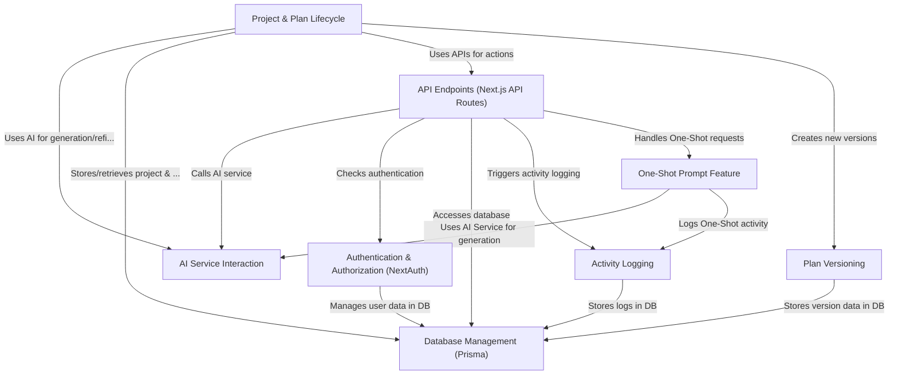

# Tutorial: Web-Planner-AI

Web-Planner-AI helps users turn a website idea into a *detailed plan*.
You provide an idea, and the application uses **Artificial Intelligence (AI)** to research it and generate an initial plan.
You can give feedback, and the AI will *refine* the plan, creating different **versions** you can track.
Finally, it can generate prompts to help build the website, including a special **"One-Shot" prompt** for AI code editors.

**Source Repository:** [https://github.com/moobfinancial/Web-Planner-AI.git](https://github.com/moobfinancial/Web-Planner-AI.git)

## Chapters

1. [Authentication & Authorization (NextAuth)](01_authentication___authorization__nextauth_.md)
2. [Project & Plan Lifecycle](02_project___plan_lifecycle.md)
3. [AI Service Interaction](03_ai_service_interaction.md)
4. [Plan Versioning](04_plan_versioning.md)
5. [One-Shot Prompt Feature](05_one_shot_prompt_feature.md)
6. [API Endpoints (Next.js API Routes)](06_api_endpoints__next_js_api_routes_.md)
7. [Database Management (Prisma)](07_database_management__prisma_.md)
8. [Activity Logging](08_activity_logging.md)

---

Generated by [AI Codebase Knowledge Builder](https://github.com/The-Pocket/Tutorial-Codebase-Knowledge)